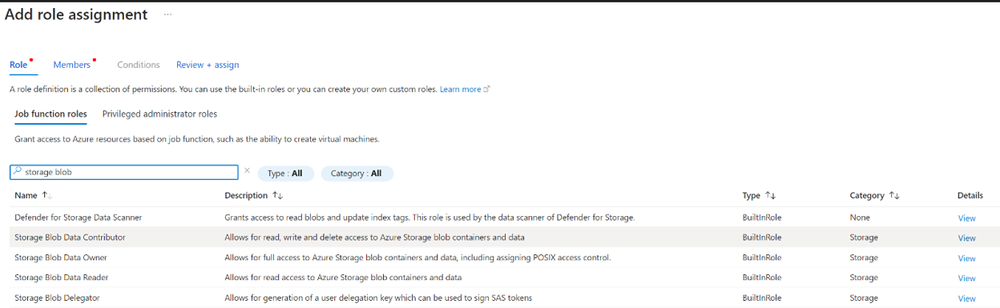

### Warehouse 

This SQL command creates a warehouse named az_warehouse, with an 'X-SMALL' size, and it's set to auto-suspend after 90 seconds of inactivity and auto-resume on the next query if it's suspended.

``` 
CREATE WAREHOUSE IF NOT EXISTS az_wh 
WITH WAREHOUSE_SIZE = 'X-SMALL'
AUTO_SUSPEND = 90
AUTO_RESUME = TRUE;

```

### Database 

This command creates a database named AZDB.

``` 
CREATE DATABASE IF NOT EXISTS AZDB;

```

### Create a Storage Integration in Snowflake

This object specifies the Azure Blob Storage and provides a secure mechanism for Snowflake to interact with Azure resources.

```
CREATE STORAGE INTEGRATION azure_int
  TYPE = EXTERNAL_STAGE
  STORAGE_PROVIDER = AZURE
  ENABLED = TRUE
  STORAGE_ALLOWED_LOCATIONS = ('azure://<your_storage_account_name>.blob.core.windows.net/<your_container_name>/')
  AZURE_TENANT_ID = '<your_azure_tenant_id>';
```


* Replace <your_storage_account_name> with your Azure storage account name.
* Replace <your_container_name> with the name of your Azure Blob Storage container.
* Replace <your_azure_tenant_id> with your Azure tenant ID.


### Retrieve Storage Integration Properties 

```
DESC STORAGE INTEGRATION azure_int;

```

Take note of the AZURE_CONSENT_URL value from the output. Copy the URL from the AZURE_CONSENT_URL property and open it in a web browser. You must be logged into your Azure account with sufficient permissions to grant consent.

https://login.microsoftonline.com/40a6c74b-fac4-48db-b9dc-540ae32d96fe/oauth2/authorize?client_id=b7c3ffdc-2927-48ce-a4b7-0c14cb596ffb&response_type=code

### Grant Permission in Azure

You need to allow Snowflake's generated object ID to access your Azure Blob Storage:

Navigate to the Azure Portal:

1. Go to your Blob storage account.
2. Select "Access control (IAM)" and click on "+ Add" to add a new role assignment.



3. Select members
4. Returnt to snowflake and find AZURE_MULTI_TENANT_APP_NAME. You can get it, if run 

```
DESC STORAGE INTEGRATION azure_int;

```


5.Select
6.Review + assign


## Create schema

```
CREATE SCHEMA IF NOT EXISTS AZDB.file_formats;
CREATE SCHEMA IF NOT EXISTS AZDB.external_stages;
```

### Create file format

Before you can load data into Snowflake, you need a target table that matches the structure of your source data in Azure Blob Storage.

1. Create a File Format (if not defined within the stage).

```
CREATE OR REPLACE file format azdb.file_formats.csv_format
    type = csv
    field_delimiter = ','
    field_optionally_enclosed_by = '"'
    skip_header = 1;
```

### Create or Use an External Stage

With the storage integration configured, you can create an external stage in Snowflake that uses this integration to access data in Azure Blob Storage.

```
USE SCHEMA azdb.external_stages;
CREATE STAGE my_azure_stage
  STORAGE_INTEGRATION = azure_int
  URL = 'azure://stazsnowflake.blob.core.windows.net/azurefiles/'
  FILE_FORMAT = azdb.file_formats.csv_format;
```

### Prepare Snowflake environment    

1. Create a Target Table. Ensure you have a table in Snowflake that matches the schema of the data you're loading.

```
-- Create a  Table

CREATE TABLE azdb.raw.olist_order_reviews (
    review_id STRING,
    order_id STRING,
    review_score NUMBER(1,0),
    review_comment_title STRING,
    review_comment_message STRING,
    review_creation_date TIMESTAMP_NTZ,
    review_answer_timestamp TIMESTAMP_NTZ 
); 

COPY INTO azdb.raw.olist_order_reviews
  FROM @azdb.external_stages.my_azure_stage
  PATTERN='.*olist_order_reviews_dataset.*.csv';

CREATE TABLE azdb.raw.geolocation_data (
    geolocation_zip_code_prefix VARCHAR(5), 
    geolocation_lat FLOAT, -- Latitude, requiring floating-point to handle decimal values.
    geolocation_lng FLOAT, -- Longitude, also requiring floating-point for decimal values.
    geolocation_city VARCHAR(100), 
    geolocation_state CHAR(2) 
);

COPY INTO azdb.raw.geolocation_data
  FROM @azdb.external_stages.my_azure_stage
  PATTERN='.*olist_geolocation_dataset.*.csv';

  
CREATE TABLE azdb.raw.olist_order_items (
    order_id VARCHAR(32), 
    order_item_id INTEGER, 
    product_id VARCHAR(32), 
    seller_id VARCHAR(32),
    shipping_limit_date TIMESTAMP_NTZ, 
    price FLOAT, 
    freight_value FLOAT 
);

COPY INTO azdb.raw.olist_order_items
  FROM @azdb.external_stages.my_azure_stage
  PATTERN='.*olist_order_items.*.csv';

CREATE TABLE azdb.raw.olist_order_payments (
    order_id VARCHAR(32), -- For UUIDs or similar unique identifiers.
    payment_sequential INTEGER, 
    payment_type VARCHAR(20), 
    payment_installments INTEGER, 
    payment_value FLOAT 
);


COPY INTO azdb.raw.olist_order_payments
  FROM @azdb.external_stages.my_azure_stage
  PATTERN='.*olist_order_payments.*.csv';

CREATE TABLE azdb.raw.olist_orders (
    order_id VARCHAR(32), -- UUIDs for orders, requiring a VARCHAR type.
    customer_id VARCHAR(32), -- Similar to order_id, UUIDs for customers.
    order_status VARCHAR(20), -- Textual status of an order, e.g., "delivered".
    order_purchase_timestamp TIMESTAMP_NTZ, -- Datetime for when the order was placed, no time zone.
    order_approved_at TIMESTAMP_NTZ, -- Datetime for when the order was approved, no time zone.
    order_delivered_carrier_date TIMESTAMP_NTZ, -- Datetime for when the order was handed off to the carrier.
    order_delivered_customer_date TIMESTAMP_NTZ, -- Datetime for when the order was delivered to the customer.
    order_estimated_delivery_date TIMESTAMP_NTZ -- Estimated delivery date provided to the customer.
);


COPY INTO azdb.raw.olist_orders
  FROM @azdb.external_stages.my_azure_stage
  PATTERN='.*olist_orders.*.csv';

CREATE TABLE azdb.raw.olist_products (
    product_id VARCHAR(32), 
    product_category_name VARCHAR(50),
    product_name_length INTEGER,
    product_description_length INTEGER, 
    product_photos_qty INTEGER, 
    product_weight_g INTEGER, 
    product_length_cm INTEGER, 
    product_height_cm INTEGER, 
    product_width_cm INTEGER 
);


COPY INTO azdb.raw.olist_products
  FROM @azdb.external_stages.my_azure_stage
  PATTERN='.*olist_products.*.csv';

CREATE TABLE azdb.raw.olist_sellers (
    seller_id VARCHAR(32), 
    seller_zip_code_prefix VARCHAR(5), 
    seller_city VARCHAR(50), 
    seller_state CHAR(2) 
);

COPY INTO azdb.raw.olist_sellers
  FROM @azdb.external_stages.my_azure_stage
  PATTERN='.*olist_sellers.*.csv';


CREATE TABLE azdb.raw.olist_customers (
    customer_id VARCHAR(32), 
    customer_unique_id VARCHAR(32), 
    customer_zip_code_prefix VARCHAR(5), 
    customer_city VARCHAR(50), 
    customer_state CHAR(2) 
);

COPY INTO azdb.raw.olist_customers
  FROM @azdb.external_stages.my_azure_stage
  PATTERN='.*olist_customers.*.csv';


CREATE TABLE azdb.raw.product_category_translation (
    product_category_name VARCHAR(50), -- The original category name, assuming it won't exceed 50 characters.
    product_category_name_english VARCHAR(50) -- The English translation of the category name.
); 

COPY INTO azdb.raw.product_category_translation
  FROM @azdb.external_stages.my_azure_stage
  PATTERN='.*product_category_name_translation.*.csv';

```

### Create a Role for dbt

Before creating a user, it's a good idea to create a role that will be assigned to the dbt user. This role can then be granted the necessary permissions to access the relevant databases and schemas.
```
  -- Use an admin role
USE ROLE ACCOUNTADMIN;

-- Create the `dbt_role` role
CREATE ROLE IF NOT EXISTS dbt_role;
GRANT ROLE dbt_role TO ROLE ACCOUNTADMIN;
GRANT OPERATE ON WAREHOUSE az_wh TO ROLE dbt_role;

-- Create the `dbt` user and assign to role
CREATE USER IF NOT EXISTS dbt
  PASSWORD='azdbtsnowlooker123'
  LOGIN_NAME='dbt'
  MUST_CHANGE_PASSWORD=FALSE
  DEFAULT_WAREHOUSE='AZ_WH'
  DEFAULT_ROLE='dbt_role'
  DEFAULT_NAMESPACE='AZDB.RAW'
  COMMENT='DBT user used for data transformation';
GRANT ROLE dbt_role to USER dbt;

-- Set up permissions to role `transform`
GRANT ALL ON WAREHOUSE AZ_WH TO ROLE dbt_role; 
GRANT ALL ON DATABASE AZDB to ROLE dbt_role;
GRANT ALL ON ALL SCHEMAS IN DATABASE AZDB to ROLE dbt_role;
GRANT ALL ON FUTURE SCHEMAS IN DATABASE AZDB to ROLE dbt_role;
GRANT ALL ON ALL TABLES IN SCHEMA AZDB.RAW to ROLE dbt_role;
GRANT ALL ON FUTURE TABLES IN SCHEMA AZDB.RAW to ROLE dbt_role;


```
