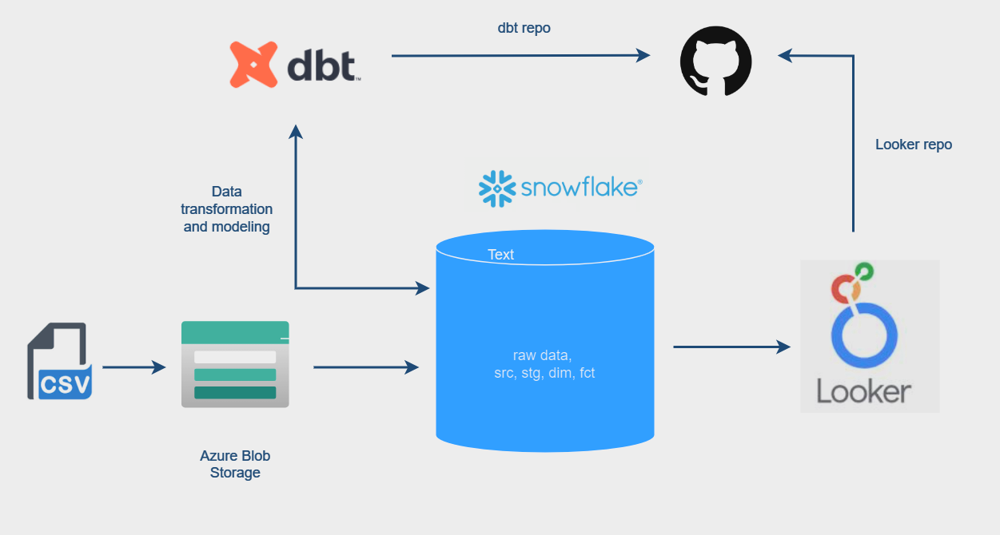

# Azure blob storage-DBT-Snowflake-Looker
Deploy Analytics Engineering pipelines with DBT Core, Snowflake and Looker

## Objectives

## Requirements

1. dbt knowledge
2. Downloaded Brazilian E-Commerce Public Dataset by Olist
3. Azure Blob Storage
4. Snowflake trial (or any data warehouse)
5. Looker
6. GitHub 
7. VS Code

## Implementation

1. Setup git repo
2. Initiate integration between azure storage & snowflake
3. Setup virtual environment
4. Install dbt 
5. Initiate integration between dbt & snowflake

## Architecture




## Connecting dbt and snowflake

### Create venv

Check python version 

```
python3.11 --version
```

First, choose or create a directory where you want to place your virtual environment. Then, create the virtual environment using the following command.

```
python3.11 -m venv myenv
```

Replace myenv with your desired name for the virtual environment.

Activate the Virtual Environment (MAC or WSL Ubuntu)

```
source myenv/bin/activate
```

### Install dbt-snowflake

```
pip install dbt-snowflake==1.8.0

dbt init dbtcoresnow 
```
### Configuration database 

[1] snowflake

Desired authentication type option (enter a number): 1    

password (dev password): 

role (dev role): dbt_role

warehouse (warehouse name): AZ_WH

database (default database that dbt will build objects in): AZDB

schema (default schema that dbt will build objects in): DEV

threads (1 or more) [1]: 1 


6. Made all transformation

Run '''dbt run''' to execute the models and transform the data.
Run '''dbt test''' to run tests on the transformed data.
Run '''dbt docs generate''' to generate documentation for the models.
Run '''dbt docs serve''' to view the documentation in your browser.


