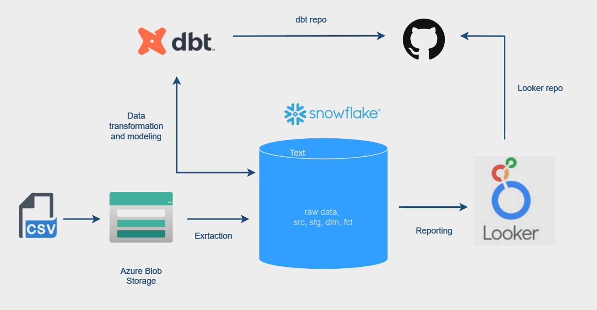

# Azure blob storage-DBT-Snowflake-Looker
Deploy Analytics Engineering pipelines with DBT Core, Snowflake and Looker

## Objectives

## Requirements

1. dbt knowledge
2. Downloaded Brazilian E-Commerce Public Dataset by Olist
3. Azure Blob Storage
4. Snowflake trial (or any data warehouse)
5. Looker
6. GitHub 
7. VS Code

## Architecture

## Implementation

1. Setup git repo
2. Initiate integration between Azure Blob Storage & Snowflake
3. Setup virtual environment
4. Install dbt 
5. Initiate integration between dbt & Snowflake
6. Made all transformation and tests in dbt
7. Initiate integration between Snowflake and Looker
8. Initiate integration between Looker and GitHub
9. Report in Looker

6. Made all transformation

Run '''dbt run''' to execute the models and transform the data.
Run '''dbt test''' to run tests on the transformed data.
Run '''dbt docs generate''' to generate documentation for the models.
Run '''dbt docs serve''' to view the documentation in your browser.
 

