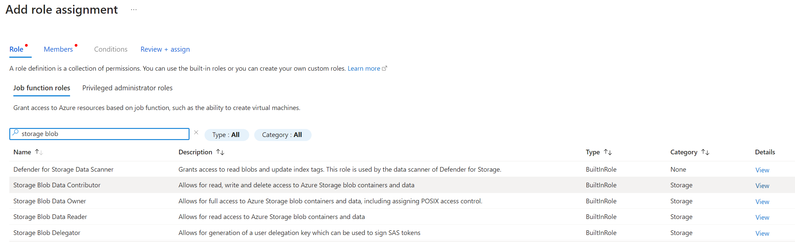
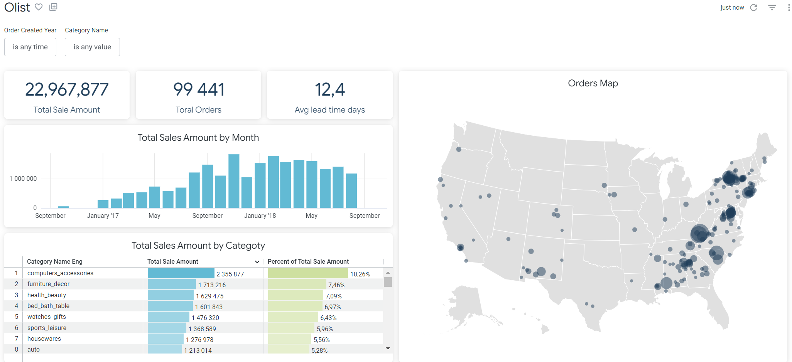

# Azure blob storage-DBT-Snowflake-Looker
Deploy Analytics Engineering pipelines with DBT Core, Snowflake and Looker

## Overview

This project showcases a example of concept for implementting a dimensional modeling strategy. The data was loaded from Azure Blob Storage into Snowflake and later transformed with DBT and analyzed in Looker.

## Requirements

1. dbt knowledge
2. Downloaded Brazilian E-Commerce Public Dataset by Olist
3. Azure Blob Storage
4. Snowflake trial (or any data warehouse)
5. Looker
6. GitHub 
7. VS Code

## Architecture


## Implementation

1. Setup git repo
2. Initiate integration between Azure Blob Storage & Snowflake
3. Setup virtual environment
4. Install dbt 
5. Initiate integration between dbt & Snowflake
6. Made all transformation and tests in dbt
7. Initiate integration between Snowflake and Looker
8. Initiate integration between Looker and GitHub
9. Report in Looker


## DAG





## Looker

1. Create connection Looker-Snowflake
2. Develop - Project - Create New LookML project (blank project)
3. Settings Looker inside project - Configure git (using SSH) - copy the deploy key and add it to Deploy keys in GitHub Setting
4. Choose GitHub integration as Pull Requests Required
5. Settings Looker: set Webhook Secret , copy and add to Webhooks in the git rep settings
6. Create the folder models and add a file (Create model)

```
connection: "snowflake_oly"

include: "/snowflake_views/*.view.lkml"
include: "/snowflake_explores/*.explore.lkml"
# include all views in the views/ folder in this project
# include: "/**/*.view.lkml"                 # include all views in this project
# include: "my_dashboard.dashboard.lookml"   # include a LookML dashboard called my_dashboard

# # Select the views that should be a part of this model,
# # and define the joins that connect them together.
#
# explore: order_items {
#   join: orders {
#     relationship: many_to_one
#     sql_on: ${orders.id} = ${order_items.order_id} ;;
#   }
#
#   join: users {
#     relationship: many_to_one
#     sql_on: ${users.id} = ${orders.user_id} ;;
#   }
# }

```

7. Create the folder View - add files from Snowflake as Create View From Table
8. Create Explores folder and explore.lkml file

```
include: "/snowflake_views/*"

explore: fct_orders {
  join: dim_customers {
    type: left_outer
    sql_on: ${fct_orders.customer_id} = ${dim_customers.customer_id} ;;
    relationship: many_to_one
  }

  join: dim_products {
    type: left_outer
    sql_on: ${fct_orders.product_id} = ${dim_products.product_id} ;;
    relationship: many_to_one
  }
}

```

9. Save - validate LookML- Commit changes & Push to Git
10. Find our model in Explore
11. Main menu - Folders - My folders - Create New dashboard 


## Report



 
## Summary

By leveraging the DBT (Data Build Tool) framework, we can effectively transform, model, and test its data. The DBT framework simplifies the process of navigating and understanding the data transformation pipeline, ensuring that data is accurately prepared for analysis.

