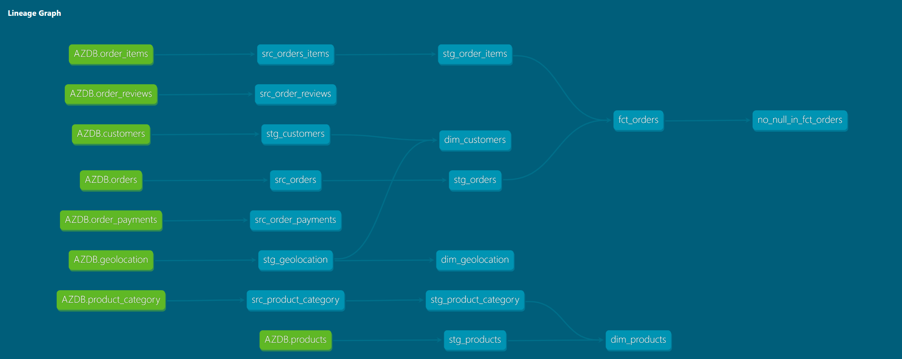

# Azure blob storage-DBT-Snowflake-Looker
Deploy Analytics Engineering pipelines with DBT Core, Snowflake and Looker

## Overview

This project showcases a example of concept for implementting a dimensional modeling strategy. The data was loaded from Azure Blob Storage into Snowflake and later transformed with DBT and analyzed in Looker.

## Requirements

1. dbt knowledge
2. Downloaded Brazilian E-Commerce Public Dataset by Olist
3. Azure Blob Storage
4. Snowflake trial (or any data warehouse)
5. Looker
6. GitHub 
7. VS Code

## Architecture

## Implementation

1. Setup git repo
2. Initiate integration between Azure Blob Storage & Snowflake
3. Setup virtual environment
4. Install dbt 
5. Initiate integration between dbt & Snowflake
6. Made all transformation and tests in dbt
7. Initiate integration between Snowflake and Looker
8. Initiate integration between Looker and GitHub
9. Report in Looker

## DAG

## Looker

## Report

 

